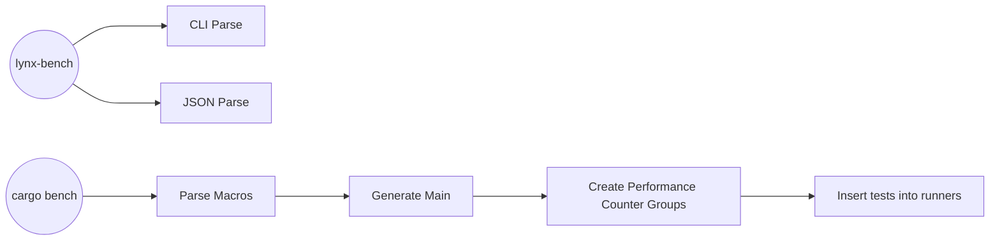

O Lynx Bench é um backend de testes de performance integrado, que tem como objetivo providenciar uma grande gama de testes, sob uma mesma interface (tanto de entrada quanto de saída ), e que seja facilmente automatizável.

## Frontend
O Frontend é o módulo que interage diretamente com o usuário, ele é responsável por ler argumentos de linha de comando e configurações em formato JSON, também abrangendo as macros procedurais de configuração de benchmark.

Além da interface direta com o usuário,  o Frontend é responsável por planejar a execução e formatar a saída para um padrão estruturado usando Formatters.

### Macros
Existem duas macros principais: 
 - `benchmark!(callback(args), runner, name?, description?, {domain: datapoints}+))` isso incluíra o Benchmark com todas as outras configurações passadas para a Macro para execução no Runner. O nome e descrição são opcionais, quando não são providenciados, o nome será o nome da função e a descrição será o conjunto de datapoints coletados
 - `benchmark_main!(runners)` cria a função main do benchmark, onde todos os runners providenciados serão realmente criados e executados (precisamos disso pois os runners precisam ser estáticos e thread-safe)
 Com estes dois pontos de entrada, fechamos a interface final via código da ferramenta.

#### Customização 
Esta parte do pipeline também pode ser customizado, podendo ser adicionadas novas ferramentas a um runner, provendo novos pontos de dados e/ou tratamento de informações .

### CLI
A interface de linha de comando sobrescreve as definições do código, executando todas as funções de benchmark com um mesmo pacote de datapoints. Não permite customização de ferramentas.

## Formatter
Estes plugins são responsáveis por interpretar os resultados providenciados pelas ferramentas, formatando a saída em algum formato customizado ou embutido (JSON, Raw, HTML, Influx, etc).
Os formatters podem ser selecionados por JSON ou argumentos de linha de comando.

O ponto de encaixe dos formatters é logo após a execução de um batch de testes (chunking feito a cada 64kb de dados). Estas estruturas receberão TestResults diretamente, e devem providenciar uma função `format(&self, chunk: Vec<TestResult>) -> String`. Eles funcionam como Serializadores e a forma mais comum de implementa-los é com o `serde`.

## Runners
Runners sai o backbone do sistema, eles agregam ferramentas e recebem informações para processar sobre as funções marcadas para teste. 
Eles funcionam utilizando o fluxo de enable->disable->flush providenciados pelas ferramentas dinâmicas, ou separando partes do código (assembly, binario ou Rust) para enviar às ferramentas estáticas.

## Statistics
Esta é outra parte altamente customizável do pipeline, providenciando funções de análise e tratamento de dados, transformando resultados de testes em uma forma matematicamente compreensível (geralmente através de relações, funções ).

## Ferramentas
As ferramentas são quaisquer estruturas em Rust que implemente `DynamicTool` ou `StaticTool`.

Os dois tipos de ferramentas têm pipelines diferentes, porém ambos retornam TestResult 

### Ferramentas estáticas
São ferramentas que analisam código, seja ele Rust, assembly ou binário, e retornam informações sobre ele. Um exemplo disso é o LLVM-MCA, que recebe código em assembly e computa dados deterministicos sobre o pipeline de CPU.

